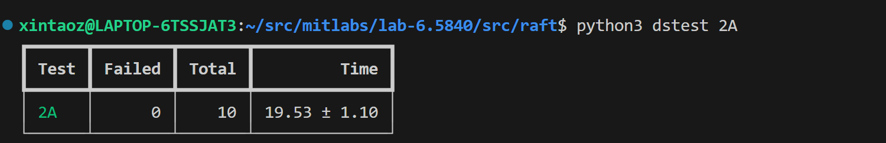
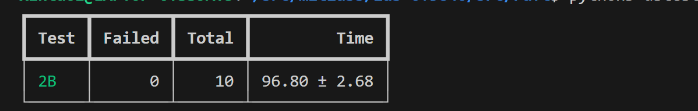

Lab 2A

before impl:
1. log message to file
2. always check for killed
3. 1 seconds 10 heartbeat at most

design:
1. send heartbeat to all peers every 200ms
2. election timeout range from 2000ms - 3000ms


Tests
2A



2B
Individuals:
1. VERBOSE=1 go test -run BasicAgree | dslogs -c 3 > test.log
2. VERBOSE=1 go test -run RPCBytes | dslogs -c 3 > test.log


2C
major issue
1. index out of range
6.5840/raft.(*Raft).startAppendEntries(0xc00014cb60)
	/home/xintaoz/src/mitlabs/lab-6.5840/src/raft/raft.go:507 +0x4f5
created by 6.5840/raft.(*Raft).ticker.func1
	/home/xintaoz/src/mitlabs/lab-6.5840/src/raft/raft.go:405 +0xc5
exit status 2
FAIL	6.5840/raft	20.554s

the ```				PrevLogTerm:  rf.log[rf.nextIndex[i]-1].Term,```
has the **index out of range** issue

2. commit index
apply error: commit index=117 server=4 3431 != server=0 7996
exit status 1
FAIL    6.5840/raft     36.421s
